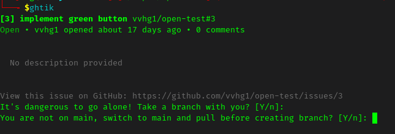

# ghtik
# GitHub Ticket Status Checker and Modifier

This Bash script can check and modify the status of tickets on GitHub repositories. It provides a convenient command-line interface to interact with GitHub issues, allowing to view, update status, assign, and more.
When executed from a Git repository, the script will automatically detect the project associated with the repository and fetch the tickets for that project.

When a ticket is selected, the description is printed to the terminal, and you are prompted to choose an action to perform on the ticket. Actions include moving the ticket to a different status column, closing it, or assigning it to a user.

When a ticket is moved into the "in progress" column, the script will prompt for the creation of a new branch with the ticket number and title as the branch name. It also checks if the user has currently checked out "main" or "dev" branch and will prompt to switch to "dev" (takes precedence over "main" if both exist) or "main" branch before creating the new branch.

## Prerequisites

- [GitHub CLI (gh)](https://cli.github.com/)
- fzf (Fuzzy Finder)
- Bash shell


## Installation

1. Clone or download the script to your local machine.
2. Source the script in your `.bashrc` or `.bash_profile` file:

```bash
source /path/to/ghtik.sh
```
3. Make sure `fzf` is installed on your system.
4. Make sure `gh` is installed and authenticated with your GitHub account.


## Usage

Run the script with the following command:

```bash
ghtik [FLAGS]
```


### Flags

- `-h, --help`: Display help information.
- `-a, --all`: Show all tickets, including done tickets.
- `-l, --list`: List all tickets in the current project.
- `-o, --options`: Show all options, including ticket manipulation.
- except for the -h flag, the other single-letter flags can be combined with each other, eg.: ghtik -ao

### Ticket Manipulation

- Tickets can be searched using fuzzy search.


- Selecting a ticket will prompt you to manipulate it.
- Actions include moving the ticket to a different status column, closing it, or assigning it to a user.
- Assigning to "@me" will assign the ticket to you.


- For the non --options mode, the project only displays the options to move the ticket into "In Progress"/"in progress"  or "Sprint Backlog"/"sprint backlog" columns. For the --options mode, the project displays all the options to move the ticket into any column, close the ticket, assign the ticket to a user.


- Moving a ticket to the "In Progress" column will prompt for the creation of a new branch with the ticket number and title as the branch name.


- If the user currently has not checked out "main" or "dev" branch, the script will prompt to switch to "dev" or "main" branch before creating the new branch.




## Examples

```bash
# Show help
ghtik --help

# List all tickets in the current project
ghtik -l

# Show all tickets, including done tickets
ghtik -a

# Show all options, including ticket manipulation, you can also create an alias eg.: alias ghtik="ghtik -o"
ghtik -o
```

## Contributing

Contributions are welcome! Feel free to open issues or submit pull requests.

## License

This script is licensed under the [MIT License](LICENSE).
```
